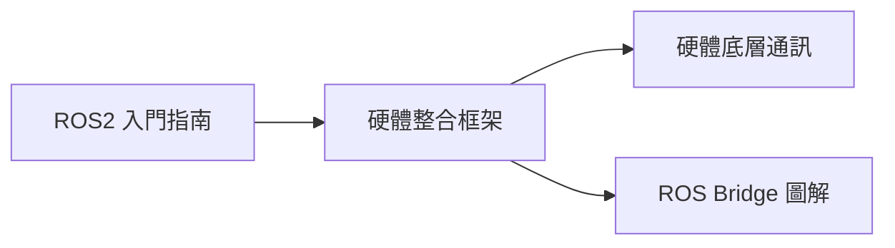

# ROS2 硬體開發與學習指南 (roshelp)

歡迎來到 **ROS2 硬體開發指南** 儲存庫。本專案旨在提供將物理硬體組件與 ROS2 (Robot Operating System 2) 生態系統整合的全面知識庫，涵蓋從高階架構框架到低階通訊協定的圖解指南。

---

## 🛠️ 文件導覽與建議閱讀順序

您可以根據以下順序學習如何橋接軟體演算法與物理硬體：

### 文件列表詳解

| 文件 | 說明 |
| :--- | :--- |
| [1. ROS2 入門與核心概念](ROS_Introduction.md) | 專為新手準備的基礎指南，涵蓋節點、主題、服務、動作及 DDS 中介軟體。 |
| [2. 硬體整合框架 (Framework)](ROS_Hardware_Integration_Framework.md) | 學習「大腦與軀幹」的比喻，以及模組化、具備擴充性的三層架構。 |
| [3. 底層硬體通訊 (Communication)](ROS2_Hardware_Communication.md) | 深入研究常用協定（UART, I2C, CAN, SPI, Ethernet）與 ROS2 節點的整合。 |
| [4. ROS Bridge 圖解 (Bridge)](ROS_Bridge_Guide.md) | 透過 WebSocket 讓非 ROS 系統（如網頁、行動裝置）與 ROS2 溝通。 |

---

## 🚀 核心特點

- **模組化設計**：學習如何抽象化硬體，即使更換馬達，高階控制程式碼也無需修改。
- **分散式開發**：利用 TCP/IP 特性，在不同裝置（如樹莓派與 PC）之間分配運算負載。
- **實戰導向**：提供實用的程式碼片段與架構圖，幫助您快速從模擬跨入實體機器人開發。

---
*最後更新日期：2026-04-16*
