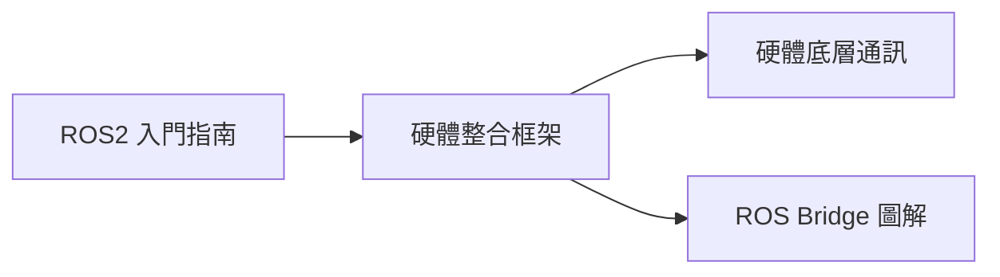

# ROS2 學習資源索引

本專案收錄 ROS2 入門到實務整合的圖解指南，適合機器人開發初學者閱讀。

## 文件列表

| 文件 | 說明 |
|------|------|
| [ROS2 入門指南](ROS2_Introduction.md) | ROS2 核心機制與基礎概念介紹 |
| [硬體整合框架](ROS_Hardware_Integration_Framework.md) | ROS 開發平台與機器人硬體的架構關係 |
| [硬體底層通訊](ROS2_Hardware_Communication.md) | UART / I2C / CAN 等底層協定與 ROS2 節點整合方式 |
| [ROS Bridge 圖解](ROS_Bridge_Guide.md) | 透過 WebSocket 讓非 ROS 系統與 ROS2 溝通 |

## 建議閱讀順序

