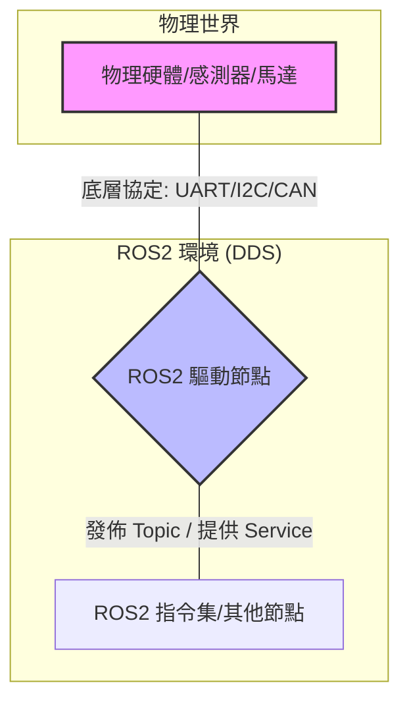
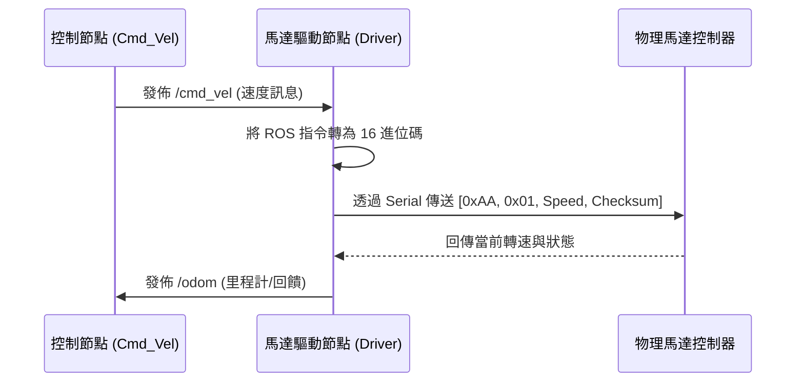

# ROS2 節點與硬體組件：底層通訊方式指南

在 ROS2 開發中，節點 (Node) 通常充當「轉譯者」的角色：一端對接 ROS2 網路 (DDS)，另一端對接物理硬體。本文件將說明硬體底層通訊的常見方式，並展示如何將這些數據接入 ROS2 系統。

---

## 1. 硬體通訊架構概覽

硬體與 ROS2 節點之間的溝通，主要發生在 **硬體抽象層 (Hardware Abstraction Layer)**。



---

## 2. 常見的底層通訊方式

根據硬體類型與數據傳輸需求，常見的通訊協定包括：

### 2.1 UART (通用非同步收發傳輸器) / Serial
*   **特點**：簡單、成熟、點對點。
*   **常見設備**：Arduino, GPS 模組, 某些平價光達 (LiDAR), 電子羅盤。
*   **ROS2 整合**：通常使用 `pyserial` (Python) 或 `boost::asio` (C++)。

### 2.2 I2C (積體電路匯流排)
*   **特點**：主從式架構 (Master-Slave)，適合短距離、低速傳輸。
*   **常見設備**：IMU (慣性測量單元), 溫濕度感測器, OLED 顯示螢幕。
*   **ROS2 整合**：使用 `smbus2` 或 `/dev/i2c-*` 介面。

### 2.3 SPI (串列週邊介面)
*   **特點**：高速、全雙工，適合大量數據交換。
*   **常見設備**：高速高精度顯卡、某些高取樣率的編碼器 (Encoder)。
*   **ROS2 整合**：使用 `spidev` 函式庫。

### 2.4 CAN Bus (控制器區域網路)
*   **特點**：多主架構、抗干擾能力極強、即時性高。
*   **常見設備**：工業馬達驅動器 (如輪胎電機)、車用系統、自動化設備。
*   **ROS2 整合**：使用 `SocketCAN` (Linux 內建) 配合 `python-can`。

### 2.5 Ethernet / UDP / TCP
*   **特點**：頻寬極高，支援長距離。
*   **常見設備**：高階 3D LiDAR (如 Velodyne, Robosense), 工業相機 (GigE Camera)。

---

## 3. 實戰練習：馬達驅動器通訊範例

假設我們有一個透過 **Serial (UART)** 通訊的馬達控制器，我們需要寫一個 ROS2 節點來將「轉速指令」發送給它。

### 3.1 通訊流程圖



### 3.2 Python 核心程式碼片段 (示意)

```python
import rclpy
from rclpy.node import Node
from geometry_msgs.msg import Twist
import serial # 底層通訊庫

class MotorDriverNode(Node):
    def __init__(self):
        super().__init__('motor_driver')
        # 1. 初始化底層 Serial 通訊
        self.ser = serial.Serial('/dev/ttyUSB0', 115200, timeout=0.1)
        
        # 2. 訂閱 ROS2 的控制指令
        self.subscription = self.create_subscription(
            Twist,
            'cmd_vel',
            self.cmd_vel_callback,
            10)

    def cmd_vel_callback(self, msg):
        # 3. 邏輯轉譯：將 ROS 指令轉為硬體能聽懂的封包
        linear_v = msg.linear.x
        packet = self.format_packet(linear_v)
        
        # 4. 執行底層傳輸
        self.ser.write(packet)
        self.get_logger().info(f'已發送原始數據給馬達: {packet.hex()}')

    def format_packet(self, speed):
        # 假設封包格式：[起始位, 功能碼, 速度值, 校驗位]
        speed_byte = int(speed * 100) & 0xFF
        return bytes([0xAA, 0x01, speed_byte, 0x55])

def main():
    # ... 初始化與運行 ...
    pass
```

---

## 4. 總結：開發建議

1.  **分離通訊與邏輯**：建議將底層協定的實作 (如 Serial 讀寫) 寫成獨立的 Class，方便單獨測試，不依賴 ROS 環境。
2.  **錯誤處理**：底層通訊容易受雜訊干擾，務必加入 Checksum (校驗碼) 檢查。
3.  **非同步處理**：如果底層讀取會阻塞 (Blocking)，應考慮使用多執行緒 (Threading) 來分別處理「讀取」與「寫入」，避免影響 ROS 節點的響應速度速度。

---
*文件產生於 2026-04-13*
