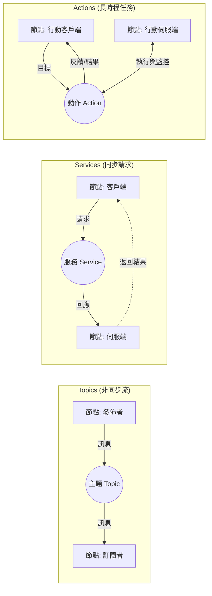

# ROS2 (Robot Operating System 2) 入門指南：從基礎到進階

這是一份為機器人開發者準備的 ROS2 介紹文件，旨在幫助您從零開始理解 ROS2 的核心機制與優勢。

---

## 1. 什麼是 ROS2？

**ROS2** 並不是一個真正的「作業系統」，而是一套**機器人開發的中介軟體 (Middleware)**。它提供了一系列的工具、函式庫以及約定，讓開發者能跨進程、跨電腦地實現複雜的機器人功能。

### 為什麼選擇 ROS2 而非 ROS1？
- **即時性 (Real-time)**：支援即時控制需求。
- **安全性**：引入 DDS (Data Distribution Service) 安全規範 (SROS2)。
- **跨平台**：完美支援 Linux, Windows, macOS。
- **分散式架構**：不再依賴一個中心化的 `roscore`。

---

## 2. 核心概念 (Core Concepts)

ROS2 的架構建立在「節點」通訊的基礎上。

### 2.1 節點 (Nodes)
節點是執行特定任務的最小單位（例如：一個讀取光達數據的節點，另一個控制馬達的節點）。
- 一個機器人系統通常由許多節點組成。
- 優點：模組化、容錯性高。

### 2.2 通訊機制 (Communication)
ROS2 提供四種主要的通訊方式，下圖展示了節點（Node）之間如何透過不同的機制進行互動：



1.  **Topics (主題)**：
    - **模式**：發佈/訂閱 (Publish/Subscribe)。
    - **特性**：非同步、多對多。
    - **用途**：感測器數據流（如圖像、雷達掃描）。
2.  **Services (服務)**：
    - **模式**：請求/回應 (Request/Response)。
    - **特性**：同步或等待式、一對一。
    - **用途**：短暫的狀態查詢或簡單的指令。
3.  **Actions (動作)**：
    - **模式**：目標/反饋/結果 (Goal/Feedback/Result)。
    - **特性**：可取消、長時程、有中間反饋。
    - **用途**：導航到某點、執行一段複雜的機械臂動作。
4.  **Parameters (參數)**：
    - **用途**：節點的配置設定（如馬達速度上限、相機解析度）。

---

## 3. 開發環境與工作空間

### 3.1 工作空間 (Workspace)
ROS2 的開發通常在 `colcon_ws` 中進行。
- `src/`：放置源碼（Packages）。
- `build/`：編譯過程的中間檔案。
- `install/`：編譯後的執行檔與環境設定。

### 3.2 封裝 (Packages)
Package 是 ROS2 程式碼的基本組織單位，必須包含：
- `package.xml`：定義依賴關係。
- `CMakeLists.txt` (C++) 或 `setup.py` (Python)。

---

## 4. 常用指令 (CLI Tools)

熟練這些指令是開發的基礎：

```bash
# 查看所有運行中的節點
ros2 node list

# 查看所有主題
ros2 topic list

# 顯示主題內容
ros2 topic echo /topic_name

# 呼叫服務
ros2 service call /service_name service_type "{data: value}"

# 執行節點
ros2 run package_name executable_name
```

---

## 5. 實戰範例：撰寫第一個 Python 節點

以下是一個簡單的 Talker 節點範例，展示 ROS2 的基本程式結構。

### 5.1 程式碼範例 (talker.py)
```python
import rclpy
from rclpy.node import Node
from std_msgs.msg import String

class SimpleTalker(Node):
    def __init__(self):
        super().__init__('simple_talker')
        # 建立發佈者 (Topic 名稱為 'chatter', 隊列大小為 10)
        self.publisher_ = self.create_publisher(String, 'chatter', 10)
        # 設定定時器，每 0.5 秒執行一次
        self.timer = self.create_timer(0.5, self.timer_callback)
        self.i = 0

    def timer_callback(self):
        msg = String()
        msg.data = f'Hello ROS2: {self.i}'
        self.publisher_.publish(msg)
        self.get_logger().info(f'Publishing: "{msg.data}"')
        self.i += 1

def main(args=None):
    rclpy.init(args=args)
    node = SimpleTalker()
    try:
        rclpy.spin(node)
    except KeyboardInterrupt:
        pass
    node.destroy_node()
    rclpy.shutdown()

if __name__ == '__main__':
    main()
```

### 5.2 重點解析
- `rclpy.init()`：初始化 ROS2 Python 客戶端庫。
- `Node`：所有 ROS2 節點的基類。
- `create_publisher`：宣告此節點要往哪個主題發送訊息。
- `rclpy.spin(node)`：進入迴圈，等待定時器或回調函數執行。

---

## 6. 進階架構：DDS 與 Middleware

ROS2 最底層使用 **DDS (Data Distribution Service)** 標準。
- **去中心化**：節點之間透過 Discovery 機制自動發現彼此。
- **QoS (Quality of Service)**：這是在 ROS2 中極為重要的進階設定。
    - **Reliability**：可靠 (TCP-like) 或 盡力而為 (UDP-like)。
    - **Durability**：是否儲存歷史訊息給新加入的訂閱者。
    - **History**：快取訊息的數量。

---

## 6. 進階開發技巧

### 6.1 Composition (組件化)
ROS2 允許將多個節點載入到同一個作業系統進程中，這稱為 **Composition**。
- **優點**：減少數據傳輸時的序列化開銷 (Zero-copy memory transport)，大幅提升性能。

### 6.2 Managed Nodes (Lifecycle Nodes)
生命週期節點允許對節點狀態進行精細控制（Unconfigured, Inactive, Active, Finalized）。
- **用途**：確保系統啟動時，所有感測器節點都已就緒，導航節點才開始運作。

### 6.3 Launch 檔案
使用 Python 或 XML 編寫 Launch 檔案，一次啟動數十個節點並設定它們的參數與命名空間。

---

## 7. 總結：學習路徑建議

1.  **基礎**：學會使用 CLI 指令操作主題與服務。
2.  **開發**：嘗試用 Python 撰寫一個簡單的 Talker/Listener。
3.  **架構**：學習如何自定義 `.msg` 與 `.srv` 檔案。
4.  **進階**：深入研究 QoS 設定與多機器人組網。

---
*文件產生於 2026-04-13*
