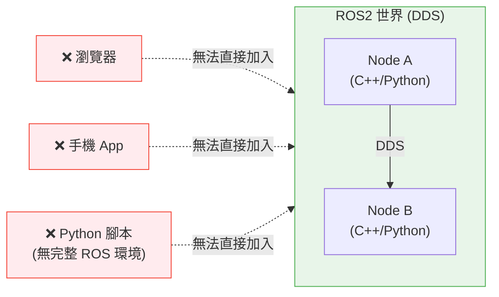
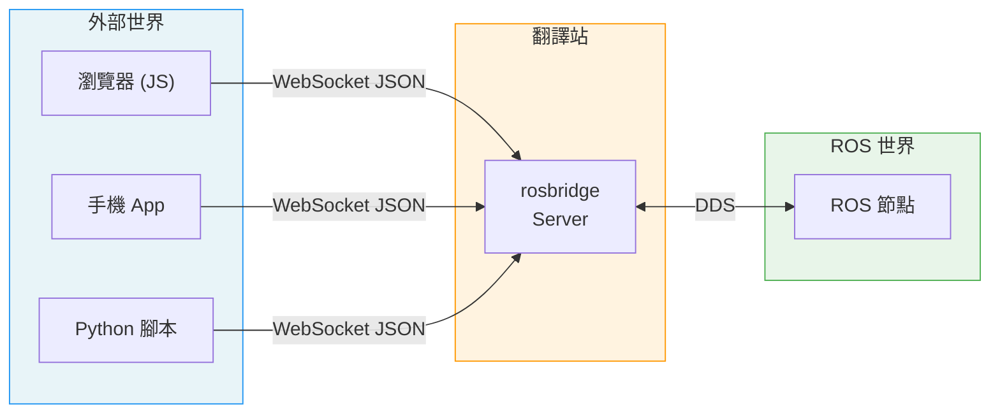
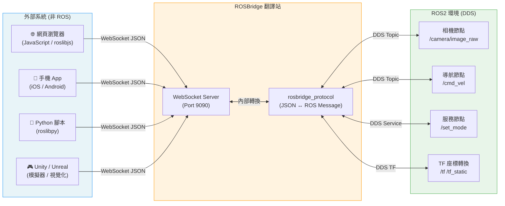
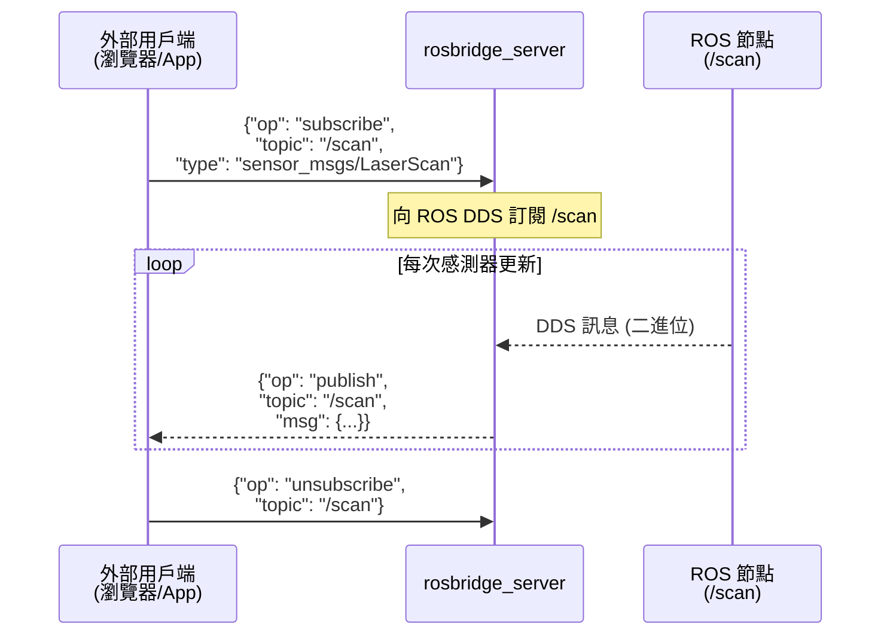
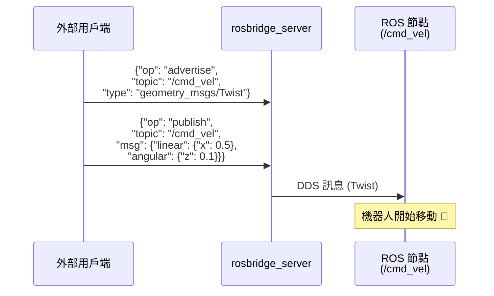
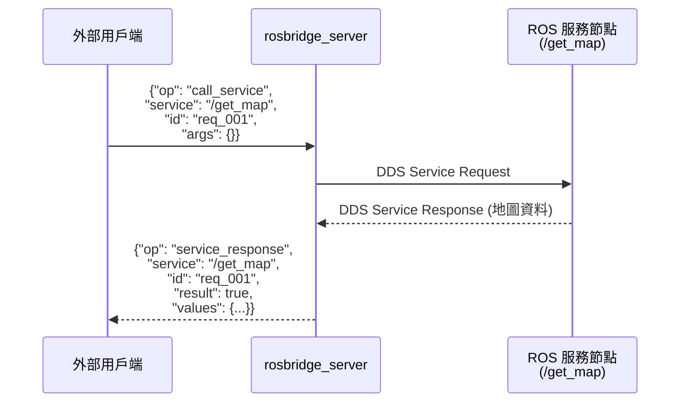
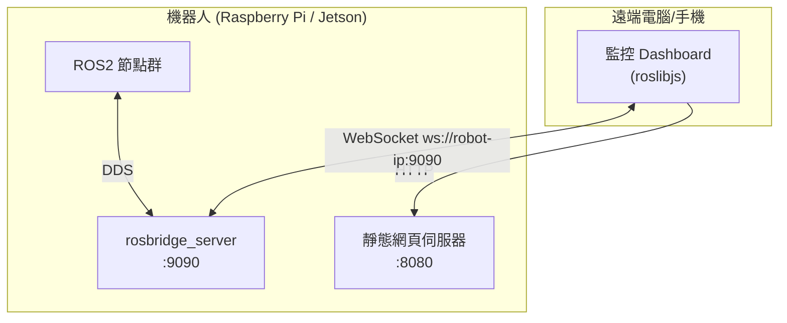
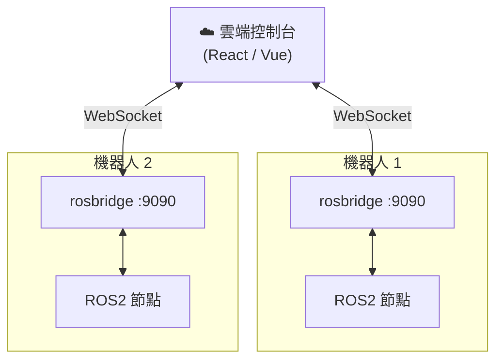
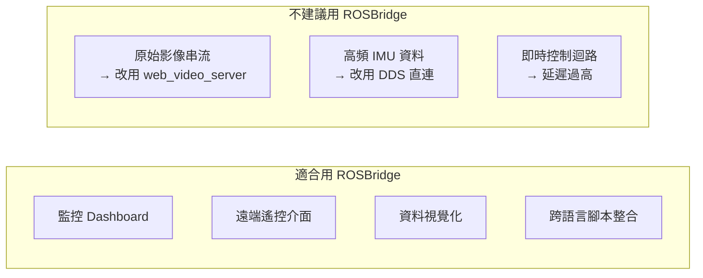

# ROS Bridge 圖解指南

ROSBridge 是一套讓「非 ROS 系統」與「ROS 世界」溝通的橋梁協定與工具套件。透過 WebSocket + JSON，任何語言、任何平台都可以與 ROS 節點互動，無需安裝 ROS 本身。

---

## 1. 核心概念：為何需要 Bridge？

ROS 內部使用 **DDS (Data Distribution Service)** 作為通訊中間件，這是一套高效但封閉的二進位協定，只有 ROS 節點才能直接溝通。



**ROSBridge 的解法**：在 ROS 世界邊緣架一個「翻譯站」，將 DDS 訊息轉成通用的 JSON over WebSocket：



---

## 2. 完整架構圖



---

## 3. ROSBridge 協定詳解

所有訊息皆為 **JSON 格式**，透過 WebSocket 傳輸。核心操作有三種：

### 3.1 Subscribe（訂閱 Topic）

外部系統向 ROSBridge 訂閱一個 Topic，當 ROS 節點發布訊息時，Bridge 自動推送給訂閱者。



### 3.2 Publish（發布 Topic）

外部系統透過 Bridge 向 ROS 發送指令，如控制機器人移動。



### 3.3 Service Call（呼叫服務）

外部系統呼叫 ROS Service，等待回應（類似 HTTP 請求）。



---

## 4. 典型部署架構

### 情境 A：機器人本機 + 遠端監控頁面



### 情境 B：雲端控制台 + 多台機器人



---

## 5. 快速啟動

### 安裝

```bash
# ROS2 Humble
sudo apt install ros-humble-rosbridge-suite

# 或從 source
cd ~/ros2_ws/src
git clone https://github.com/RobotWebTools/rosbridge_suite
cd ~/ros2_ws && colcon build
```

### 啟動 Bridge Server

```bash
# 基本啟動（預設 Port 9090）
ros2 launch rosbridge_server rosbridge_websocket_launch.xml

# 指定 Port
ros2 launch rosbridge_server rosbridge_websocket_launch.xml port:=9091
```

### 前端 (JavaScript) 範例

```html
<!-- 引入 roslibjs -->
<script src="https://cdn.jsdelivr.net/npm/roslib/build/roslib.min.js"></script>

<script>
// 1. 建立連線
const ros = new ROSLIB.Ros({ url: 'ws://localhost:9090' });

ros.on('connection', () => console.log('✅ 已連線'));
ros.on('error',      (e) => console.log('❌ 錯誤', e));
ros.on('close',      () => console.log('🔌 已斷線'));

// 2. 訂閱感測器資料
const laserSub = new ROSLIB.Topic({
    ros,
    name: '/scan',
    messageType: 'sensor_msgs/LaserScan'
});
laserSub.subscribe((msg) => {
    console.log('雷射距離資料:', msg.ranges);
});

// 3. 發送移動指令
const cmdVel = new ROSLIB.Topic({
    ros,
    name: '/cmd_vel',
    messageType: 'geometry_msgs/Twist'
});
const twist = new ROSLIB.Message({
    linear:  { x: 0.2, y: 0, z: 0 },
    angular: { x: 0,   y: 0, z: 0.5 }
});
cmdVel.publish(twist);
</script>
```

### Python 範例 (roslibpy)

```python
import roslibpy

# 建立連線
client = roslibpy.Ros(host='localhost', port=9090)
client.run()

# 訂閱 Topic
listener = roslibpy.Topic(client, '/chatter', 'std_msgs/String')
listener.subscribe(lambda msg: print(f'收到: {msg["data"]}'))

# 發布 Topic
talker = roslibpy.Topic(client, '/cmd_vel', 'geometry_msgs/Twist')
talker.publish(roslibpy.Message({
    'linear':  {'x': 0.5, 'y': 0.0, 'z': 0.0},
    'angular': {'x': 0.0, 'y': 0.0, 'z': 0.0}
}))

client.termination_handler()
```

---

## 6. ROSBridge vs 其他方案比較

| 方案 | 協定 | 需要 ROS? | 適用情境 |
|------|------|-----------|----------|
| ROSBridge | WS + JSON | 否 | 網頁、跨平台 |
| ROS2 原生 DDS | DDS (RTPS) | 是 | ROS 節點互連 |
| micro-ROS | DDS (精簡版) | 部分 | 微控制器 |
| ROS1 Bridge | ROS1 ↔ ROS2 | 兩者都需要 | 系統遷移期 |
| MQTT + 自定義 | MQTT + JSON | 否 | IoT 設備 |

---

## 7. 注意事項

| 項目 | 說明 |
|------|------|
| **效能** | JSON 序列化比 DDS 二進位慢，不適合高頻率大量資料（如原始影像串流） |
| **安全** | 預設無驗證，生產環境應加 SSL (wss://) 與身份驗證 |
| **頻寬** | 訂閱高頻 Topic 前先評估網路負擔，可用 `throttle_rate` 限制推送頻率 |
| **替代品** | 影像串流建議改用 `web_video_server`；大量資料考慮 `foxglove-bridge` |


