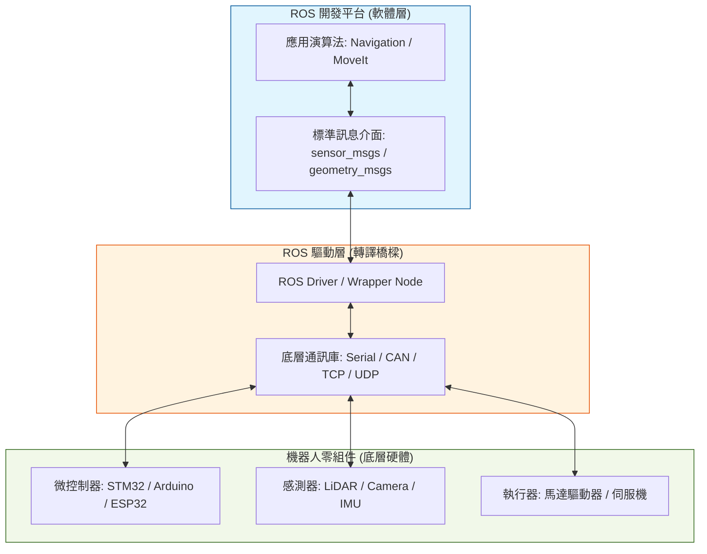

# 機器人硬體底層與 ROS 開發平台：架構關係與互動指南

在現代機器人開發中，ROS (Robot Operating System) 扮演著「通訊骨幹」與「演算法框架」的角色，而機器人零組件（硬體）則是執行指令與感知物理世界的「軀幹」。本文件旨在說明這兩者之間的架構關係以及它們是如何緊密互動的。

---

## 1. 角色定義：大腦與軀幹

為了理解兩者的關係，我們可以將機器人系統類比為生物體：

*   **ROS 開發平台 (大腦/中樞神經)**：負責高階處理，如路徑規劃、環境地圖構建 (SLAM)、影像辨識及邏輯決策。它不直接驅動電流，而是處理「資訊」。
*   **機器人零組件 (軀幹/末梢神經)**：包括馬達、編碼器、IMU 感測器、光達等。它們處理的是「物理訊號」（如電壓、脈衝、光學訊號）與「原始數據」。

---

## 2. 三層整合架構

ROS 與硬體之間並非直接連接，通常遵循以下三層架構：

*   **1. 硬體層**：微控制器、感測器與馬達。
*   **2. 通訊媒介層**：包含 Serial, CAN, USB, 以及 **TCP/IP (網路通訊)**。
*   **3. ROS 驅動層**：負責將底層封包與 ROS 標準訊息 (Topic/Service) 互轉。

### 2.1 硬體層 (Hardware Layer)
這是物理實體。硬體元件通常擁有自己的嵌入式韌體，負責即時的 PID 控制、訊號濾波或 raw data 的採集。

### 2.2 ROS 驅動層 (Driver Layer / Bridge)
這是最關鍵的互動處。
*   **由下而上 (採集)**：驅動程式透過作業系統提供的通訊介面（如 Serial, USB, 或 **TCP/IP Socket**）讀取硬體數據，並將其封裝成 **ROS Topic** 發佈出去。
*   **由上而下 (控制)**：驅動程式訂閱來自 ROS 的指令（如速度指令），並將其翻譯成硬體能理解的指令（如二進位封包、TCP/UDP 串流或 PWM 訊號）發送給硬體。

### 2.3 網路與傳輸協定：TCP/IP 的雙重地位
TCP/IP 在此架構中具有特殊的雙重身份，不應單純歸類於某一特定層級：

1.  **作為通訊工具 (Device Communication)**：
    在驅動層中，TCP/IP 是驅動程式與硬體之間的「邏輯導線」。驅動程式調用作業系統的網路堆疊 (Network Stack)，透過 IP 位址與硬體連線。這與使用 Serial 纜線的邏輯一致，只是物理介質換成了網路線或 WiFi。
2.  **作為系統底座 (Middleware Infrastructure)**：
    在 ROS 平台層內部，ROS2 的 DDS 通訊協定本身就建立在 UDP/TCP 之上。這部分與硬體無關，而是負責讓不同電腦上的 ROS 節點能夠互相通訊。
3.  **分散式開發與調試**：
    利用 TCP/IP 的特性，開發者可以實現「硬體在機器人上跑，運算在雲端做，監控在筆電上看」的分散式架構。

### 2.4 ROS 開發平台 (Application Layer)
開發者在此層面上運作，無需關心馬達是透過哪種協定連線。只要驅動層發佈了標準的 `/odom` (里程計) 或訂閱了 `/cmd_vel` (控制速度)，高階演算法就能運作。

---

## 3. 核心互動機制

### 3.1 非同步訊息 (Asynchronous Messaging)
這是最常見的互動方式。感測器不斷「廣播」數據。
*   **範例**：LiDAR 節點每秒掃描 10 次，並在 `/scan` 主題上發佈數據。ROS 導航節點隨時接收最新的掃描結果來避障。

### 3.2 同步請求與回應 (Synchronous Service)
用於「一次性」或「狀態讀取」的互動。
*   **範例**：ROS 要求硬體「歸零 (Reset Encoder)」。硬體執行完畢後回傳「成功」或「失敗」。

### 3.3 負饋控制循環 (Feedback Loop)
*   **流程**：
    1.  ROS 演算法計算出下一秒需要的座標。
    2.  將指令發送給 **ROS Control**。
    3.  ROS 驅動層將座標轉為脈衝數發送給馬達。
    4.  馬達編碼器回傳實際位置。
    5.  驅動層將位置發回 ROS，完成閉迴路。

---

## 4. 為什麼在 ROS 與硬體間建立這種關係？

1.  **硬體無關性 (Hardware Abstraction)**：
    即使你把底層的馬達從「Serial 通訊」更換為「CAN 通訊」，只要你的 ROS Driver 維持相同的 Topic 輸出（如 `/joint_states`），你的高階避障或路徑規劃程式碼完全不需要修改。
2.  **生態系整合**：
    一旦硬體接入 ROS 關係網，就能直接使用社群提供的強大工具（如 RViz 可視化硬體狀態、Gazebo 進行模擬切換）。
3.  **分散式開發**：
    你的硬體驅動可以在 Raspberry Pi 上運行，而重型運算（如影像處理）可以在 PC 上運行，兩者透過 ROS 網路無縫對接。

---
*文件修訂日期：2026-04-13*
