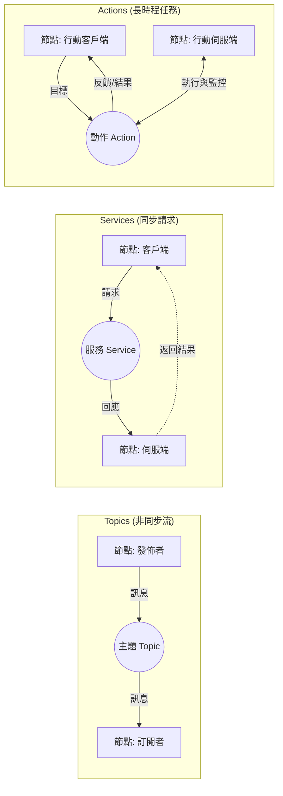

# ROS (Robot Operating System ) 入門

記錄ROS世界裡需先知道的觀念和關鍵字

---

## 1. 核心代際演進：為何現在必須學 ROS 2？
**關鍵字：** `Decentralized (去中心化)`, `DDS`, `Real-time`, `Middleware`

### 深度架構對照表：從學習到產業應用

| 比較維度 | ROS 1 | ROS 2 |
| :--- | :--- | :--- |
| **定位** | 適合學習 | 商業開發 |
| **通訊核心** | 中心化 (依賴 roscore，一旦 master node 崩掉即通訊中斷) | 去中心化 (基於 DDS 協議，節點對等連線且無單一失效點) |
| **主流演算法** | **Gmapping** (易學、適合新手) | **Cartographer** (精準、適合商用) |
| **硬體支援** | 電腦級 OS (Linux) | 跨平台與微控制器 (MCU) |
| **通訊品質** | 無 QoS | 支援 **QoS** |

<small>

### 💡 關鍵字：QoS (Quality of Service 服務品質)
ROS 2 針對不同數據需求，切換「傳輸規則」的設定：
- **Reliability (可靠性)**：
    - `Reliable`: 確保每一筆資料都送到（像傳簡訊，不容錯失）。
    - `Best Effort`: 只求快，掉了就算了（像看直播，適合感測器大數據）。
- **Durability (持久性)**：新加入的訂閱者是否能拿到之前的舊資料。
- **History (歷史快取)**：系統要暫存多少筆數據。

💡 **架構觀念**：可直接選擇內建的「Profile (預設模式，如：Sensor Data 模式)」，或針對特定需求手動微調各個參數。

</small>

---

## 2. 核心通訊機制與關鍵字
**關鍵字：** `Node`, `Topic`, `Service`, `Action`, `Parameter`, `Discovery`

ROS2 的架構建立在「節點」通訊的基礎上。

### 2.1 節點 (Nodes) —— 專業分工的「員工」
節點是負責執行單一任務的程式（例如：一個讀感測器數據，另一個控制馬達）。
- **關鍵觀념**：一個大的機器人系統是由數十個甚至上百個「員工」各司其職組成的。
- **架構優勢**：強健性高。即使其中一個節點崩潰，其他功能仍能維持運作。

### 2.2 通訊機制 (Communication)
ROS2 提供四種主要的通訊方式，下圖展示了節點（Node）之間如何透過不同的機制進行互動：



1.  **Topics (主題) —— 廣播電台**
    - **特點**：非同步、一對多或多對多。
    - **比喻**：就像廣播電台，感測器不停發送訊息，想聽的節點就自己訂閱。
    - **用途**：數據流（影像、雷達數據、馬達編碼器值）。
2.  **Services (服務) —— 櫃檯點餐**
    - **特點**：請求/回應、同步等待。
    - **比喻**：就像去餐廳點餐，你發出請求後會在那邊等，直到對方給出結果（餐點）。
    - **用途**：開關燈、系統參數重設、單次的狀態查詢。
3.  **Actions (動作) —— 長程專案任務**
    - **特點**：三段式通訊 (目標/回報/結果)、可取消、非同步。
    - **比喻**：就像叫人去執行一個長程專案，過程中會一直收到「進度 50%」的報告，你也可以中途叫他停下來。
    - **用途**：導航、機械臂執行路徑。
4.  **Parameters (參數) —— 設定檔**
    - **用途**：儲存節點的靈魂（設定值），如最大速度、PID 參數等。

---

## 3. 開發環境與工程結構
**關鍵字：** `Workspace`, `Colcon`, `Package`, `Overlay/Underlay`

### 3.1 工作空間 (Workspace) —— 你的專屬實驗室
ROS2 的開發通常在 `colcon_ws` 中進行，資料夾結構有其嚴格意義：
- `src/`：**食材區 (源碼)**。放置所有的程式原始碼 (Packages)。
- `build/`：**烹飪過程 (中間檔)**。編譯時產生的臨時檔案，通常不需要手動修改。
- `install/`：**成品區 (執行檔)**。編譯成功後的產出。**重點**：編譯完後必須執行 `source install/setup.bash` 系統才找得到這些節點。

### 💡 核心觀念：Overlay (覆蓋層) 與 Underlay (底層)
- **Underlay**：指的是由作業系統安裝的 ROS2 全域環境（如 `/opt/ros/humble`）。
- **Overlay**：指你目前正在開發的 Workspace。
- **威力之處**：你可以開發一個與系統內建同名的 Package，只要 `source` 了 Overlay，系統就會「優先使用」你的版本。這就是 ROS 靈活微調的核心。

### 3.2 封裝 (Packages) —— 程式碼的最小組織
每個 Package 必須具備的標配：
- `package.xml`：身份證，記錄版本、作者與**依賴關係**。
- `CMakeLists.txt` (C++) 或 `setup.py` (Python)：編譯與安裝的手冊。

---

## 4. 系統觀測與操作 (CLI Tools) —— 你的 X 光機
熟練這些指令是為了具備「Introspection (自省)」能力，讓你看穿系統腦袋裡在想什麼：

### 4.1 核心運行與診斷
- `ros2 node list`：**查看點名表**。看看哪些節點（員工）正在運行。
- `ros2 topic list`：**查看看板清單**。確認有哪些通訊頻道在流動。
- `ros2 topic echo /topic_name`：**監視看板內容**。實時查看感測器數據或控制指令。
- `ros2 topic hz /topic_name`：**檢查頻率**。診斷系統是否有「延遲」或「掉幀」。

### 4.2 行動與設定
- `ros2 run package_name executable_name`：**手動派駐員工**。啟動單一節點。
- `ros2 service call /service_name service_type "{data: value}"`：**發送單次指令**。

### 💡 視覺化神器：`rqt_graph`
這是架構師最愛的工具。只需在終端機輸入 `rqt_graph`，系統會直接畫出所有節點與通訊的連線圖，讓你一眼看出「誰跟誰在講話」，是診斷斷線問題的最佳解。

---

## 5. 實戰範例：最小可行節點 (Minimal Node)
**關鍵字：** `rclpy`, `Node Class`, `Publisher`, `Timer Callback`, `Spin`

以下是一個簡單的 Talker 節點範例，展示 ROS2 的基本程式結構。

### 5.1 程式碼範例 (talker.py)
```python
import rclpy
from rclpy.node import Node
from std_msgs.msg import String

class SimpleTalker(Node): # 繼承 Node，代表招募一位「員工」
    def __init__(self):
        # 1. 初始化員工名稱
        super().__init__('simple_talker')
        
        # 2. 建立「看板 (Publisher)」：主題為 'chatter'，容量 10
        self.publisher_ = self.create_publisher(String, 'chatter', 10)
        
        # 3. 設定任務：每 0.5 秒執行一次 timer_callback
        # 💡 架構師提醒：不要在 ROS 使用 while True，會卡死通訊！
        self.timer = self.create_timer(0.5, self.timer_callback)
        self.i = 0

    def timer_callback(self):
        msg = String()
        msg.data = f'Hello ROS2: {self.i}'
        self.publisher_.publish(msg) # 將訊息貼到看板上
        self.get_logger().info(f'Publishing: "{msg.data}"')
        self.i += 1

def main(args=None):
    rclpy.init(args=args) # 開公司 (初始化環境)
    node = SimpleTalker()  # 派駐員工
    try:
        rclpy.spin(node)   # 進度迴圈：讓員工保持清醒，隨時處理任務
    except KeyboardInterrupt:
        pass
    node.destroy_node()    # 員工解僱
    rclpy.shutdown()       # 公司倒閉 (資源釋放)

if __name__ == '__main__':
    main()
```

### 5.2 重點解析
- **`super().__init__('name')`**：定義節點在 `ros2 node list` 中顯示的名字。
- **`create_timer`**：異步處理的關鍵。它讓節點在等待執行的空檔，還能去處理其他的 Service 請求或參數修改。
- **`rclpy.spin(node)`**：**這行最重要**。它是一個無限迴圈，負責監聽所有「事件」（定時器時間到、收到訊息等）。沒有它，節點執行完 main 就會直接結束退出。

---

## 6. 穩定通訊的基石：DDS 與 Middleware
**關鍵字：** `DDS`, `QoS`, `RMW`, `Discovery`, `Reliability`

ROS2 最底層使用 **DDS (Data Distribution Service)** 標準。
- **去中心化**：節點之間透過 Discovery 機制自動發現彼此。
- **QoS (Quality of Service)**：這是在 ROS2 中極為重要的進階設定。
    - **Reliability**：可靠 (TCP-like) 或 盡力而為 (UDP-like)。
    - **Durability**：是否儲存歷史訊息給新加入的訂閱者。
    - **History**：快取訊息的數量。

---

## 7. 效能與維護：進階設計模式
**關鍵字：** `Composition`, `Lifecycle`, `Launch`, `Zero-copy`

### 7.1 Composition (組件化)
ROS2 允許將多個節點載入到同一個作業系統進程中，這稱為 **Composition**。
- **優點**：減少數據傳輸時的序列化開銷 (Zero-copy memory transport)，大幅提升性能。

### 7.2 Managed Nodes (Lifecycle Nodes)
生命週期節點允許對節點狀態進行精細控制（Unconfigured, Inactive, Active, Finalized）。
- **用途**：確保系統啟動時，所有感測器節點都已就緒，導航節點才開始運作。

### 7.3 Launch 檔案
使用 Python 或 XML 編寫 Launch 檔案，一次啟動數十個節點並設定它們的參數與命名空間。

---

## 8. 總結：知識網格建議
**關鍵字：** `CLI`, `Package`, `Custom Message`, `Network`

1.  **基礎**：學會使用 CLI 指令操作主題與服務。
2.  **開發**：嘗試用 Python 撰寫一個簡單的 Talker/Listener。
3.  **架構**：學習如何自定義 `.msg` 與 `.srv` 檔案。
4.  **進階**：深入研究 QoS 設定與多機器人組網。

---

## 9. 結論：從 Prototype 到 Product 的橋樑

隨著 ROS 1 在 2025 年正式停止維護，**ROS 2 已成為機器人開發的唯一標準**。它不只是版本的更新，更是從「實驗室雛型」向「工業級產品」的質變：

1.  **可靠性與安全性**：透過 DDS 技術，系統不再因單一節點（Master）崩潰而失效，並確保了數據傳輸的安全性。
2.  **更廣泛的適應性**：無論是微控制器（micro-ROS）還是高性能伺服器，ROS 2 都能提供穩定的開發範式。
3.  **生態系的成熟**：主流的 SLAM（如 Cartographer）、導航（Nav2）與感測器驅動均已在 ROS 2 上達到生產等級的效能。

**學習建議**：新進學習者應直接從 **ROS 2 Humble (LTS)** 或更新版本開始，以確保所學技術與未來產業趨勢接軌。

---
*文件更新於 2026-04-16*
